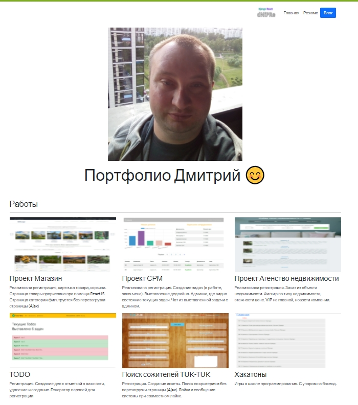

[comment]: <> ([Индивидуальные OnLine уроки по web технологиям WEBYK]&#40;https://www.webyk.in.net/&#41;)

<h4 align="center">Сайт портфолио</h4>

7 проектов включая этот

<h4 align="center">Содержание</h4>
<ol>
    <li>Портфолио</li>
    <li>Проект Магазин</li>
    <li>Проект СРМ</li>
    <li>Проект Агенство недвижимости</li>
    <li>TODO</li>
    <li>Поиск сожителей TUK-TUK</li>
    <li>Хакатоны</li>

 </ol>

<h4 align="center">Применяются технологии:</h4>

* [Python 3.9](https://www.python.org/downloads/release/python-369/)
* [Django 3](https://www.djangoproject.com/) как основной фреймворк для бекенда

<h3 align="center">Также сертификаты об обучении</h4>

        HTML
        CSS
        JavaScript
        Pyrhon 
        SQL

